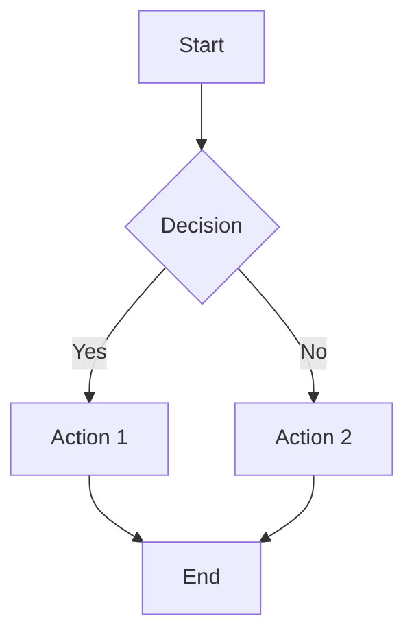
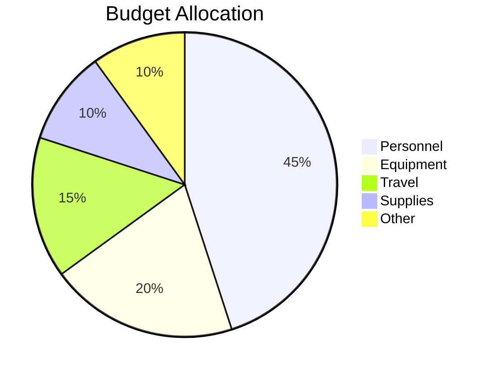

# Illustration Design Skill

Create effective visual elements for research documents.

## Quick Start

1. **Identify visualization need** - What concept needs visual support?
2. **Choose appropriate type** - Match visualization to content
3. **Design for clarity** - Prioritize understanding over decoration
4. **Integrate with text** - Visuals should complement, not replace
5. **Format consistently** - Maintain visual style throughout

## Visualization Selection Guide

### For Showing Relationships

| Need | Best Visualization |
|------|-------------------|
| Hierarchy | Tree diagram, org chart |
| Process/Flow | Flowchart, swimlane diagram |
| Cycles | Circular diagram |
| Connections | Network diagram, mind map |
| Overlap | Venn diagram |
| Parts of whole | Pie chart, treemap |

### For Showing Data

| Need | Best Visualization |
|------|-------------------|
| Trends over time | Line graph |
| Comparisons | Bar chart |
| Distributions | Histogram, box plot |
| Correlations | Scatter plot |
| Geographic | Map, choropleth |
| Multiple variables | Heat map, radar chart |

### For Showing Processes

| Need | Best Visualization |
|------|-------------------|
| Sequential steps | Flowchart |
| Decision points | Decision tree |
| Parallel activities | Swimlane diagram |
| Project timeline | Gantt chart |
| Milestones | Timeline |
| State changes | State diagram |

## Diagram Design Patterns

### Conceptual Framework Diagram

```
Purpose: Show relationships between key concepts

Structure:
┌─────────────────────────────────────────┐
│           MAIN CONCEPT                   │
├─────────────┬─────────────┬─────────────┤
│  Element 1  │  Element 2  │  Element 3  │
│     ↓       │      ↓      │      ↓      │
│  Detail A   │  Detail B   │  Detail C   │
│  Detail D   │  Detail E   │  Detail F   │
└─────────────┴─────────────┴─────────────┘
              ↓             ↓
         Outcome 1     Outcome 2

Design principles:
- Clear hierarchy from top to bottom
- Related concepts visually grouped
- Arrows show directional relationships
- Consistent shape meanings
```

### Process Flow Diagram

```
Purpose: Show sequence of steps/decisions

Structure:
┌─────┐    ┌─────┐    ┌─────┐
│Start│───▶│Step1│───▶│Step2│
└─────┘    └─────┘    └──┬──┘
                         │
                    ┌────▼────┐
                    │Decision?│
                    └────┬────┘
                    Yes/ \No
                      /   \
               ┌─────▼┐  ┌▼─────┐
               │PathA │  │PathB │
               └──────┘  └──────┘

Design principles:
- Left-to-right or top-to-bottom flow
- Consistent shapes (rectangles=steps, diamonds=decisions)
- Clear Yes/No labels on decision branches
- Single entry, clear exit points
```

### Comparison Matrix

```
Purpose: Compare multiple items across criteria

Structure:
┌────────────┬─────────┬─────────┬─────────┐
│ Criteria   │Option A │Option B │Option C │
├────────────┼─────────┼─────────┼─────────┤
│ Criterion 1│   ●●●   │   ●●○   │   ●○○   │
│ Criterion 2│   ●●○   │   ●●●   │   ●●○   │
│ Criterion 3│   ●○○   │   ●●○   │   ●●●   │
├────────────┼─────────┼─────────┼─────────┤
│ Overall    │  Good   │  Best   │  Fair   │
└────────────┴─────────┴─────────┴─────────┘

Design principles:
- Clear row/column headers
- Consistent rating symbols
- Summary row/column
- Highlight winner if applicable
```

### Timeline

```
Purpose: Show events over time

Structure:
2020        2021        2022        2023        2024
  │           │           │           │           │
  ●───────────●───────────●───────────●───────────●
  │           │           │           │           │
Event 1   Event 2     Event 3     Event 4     Event 5
Details   Details     Details     Details     Details

Design principles:
- Proportional spacing for time
- Clear event markers
- Brief labels (details in text)
- Consistent vertical alignment
```

## Data Visualization Best Practices

### Chart Selection

**Use Line Charts When:**
- Showing trends over continuous time
- Comparing trends between groups
- Data points are numerous

**Use Bar Charts When:**
- Comparing discrete categories
- Showing rankings
- Data labels need to be readable

**Use Pie Charts When:**
- Showing parts of a whole
- Categories are few (≤6)
- Percentages are the focus

**Avoid Pie Charts When:**
- Categories are many
- Comparing between groups
- Precise values matter

### Design Principles

**Data-Ink Ratio**
Maximize data, minimize non-data ink:
- Remove unnecessary gridlines
- Eliminate decorative elements
- Use direct labels vs. legends when possible

**Color Usage**
- Use color meaningfully (not decoratively)
- Ensure accessibility (colorblind-safe palettes)
- Limit to 5-7 colors maximum
- Use consistent color meanings

**Typography**
- Readable font sizes (minimum 10pt)
- Horizontal text preferred
- Clear axis labels
- Descriptive titles

## Figure Formatting

### Standard Figure Template

```markdown
Figure [N]: [Descriptive Title]

[Visual Element]

Note. [Explanation of figure, abbreviations, data source]
```

### Caption Writing

Good caption elements:
- **What:** What the figure shows
- **How to read:** Guide interpretation
- **Source:** Where data comes from
- **Abbreviations:** Define any used

**Example:**
```
Figure 3: Remote Work Adoption by Industry Sector (2019-2023)

[Chart]

Note. Data represent percentage of employees with hybrid or
fully remote arrangements. Tech includes software, hardware,
and IT services. Finance includes banking, insurance, and
investment management. Source: Bureau of Labor Statistics (2024).
```

## Accessibility Considerations

### Color Accessibility
- Don't rely on color alone to convey information
- Use patterns or labels in addition to color
- Test with colorblindness simulators
- Ensure sufficient contrast

### Screen Reader Compatibility
- Include alt text for all figures
- Provide data tables for charts
- Use descriptive titles

### Print Considerations
- Test in grayscale
- Ensure sufficient line weights
- Consider page size constraints

## Integration with Other Skills

- **content-writer**: Receives figure needs from draft
- **research-analyst**: Provides data for visualization
- **financial-analysis**: Provides financial data for charts
- **report-formatter**: Integrates figures into document layout

## Tools Reference

### Diagram Tools
- Excalidraw (hand-drawn style)
- Draw.io (technical diagrams)
- Mermaid (code-to-diagram)
- Lucidchart (professional diagrams)

### Data Visualization
- Python: matplotlib, seaborn, plotly
- R: ggplot2
- JavaScript: D3.js, Chart.js
- Spreadsheets: Excel, Google Sheets

### Quick Mermaid Examples




